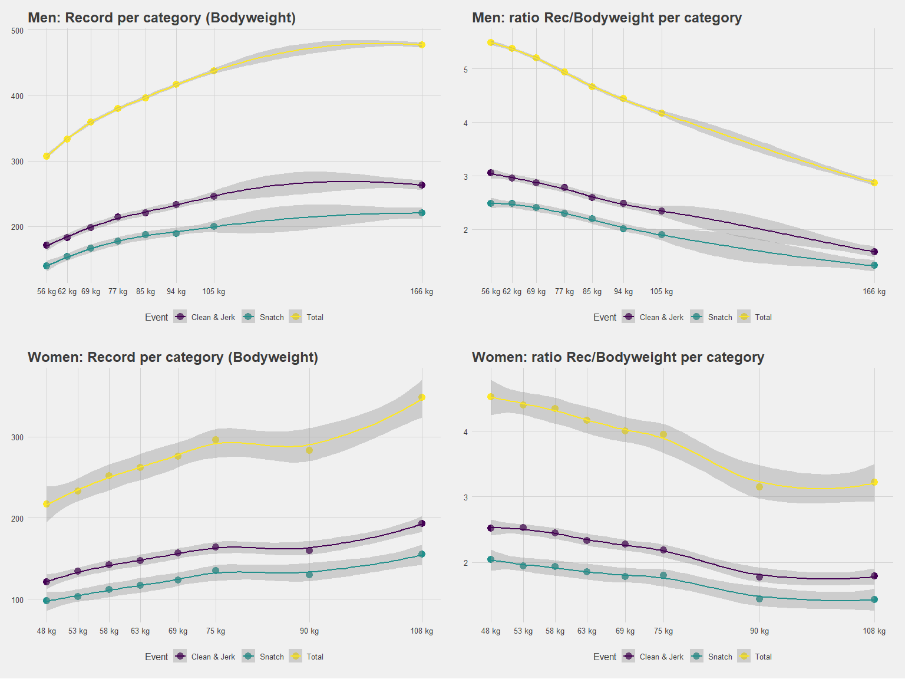
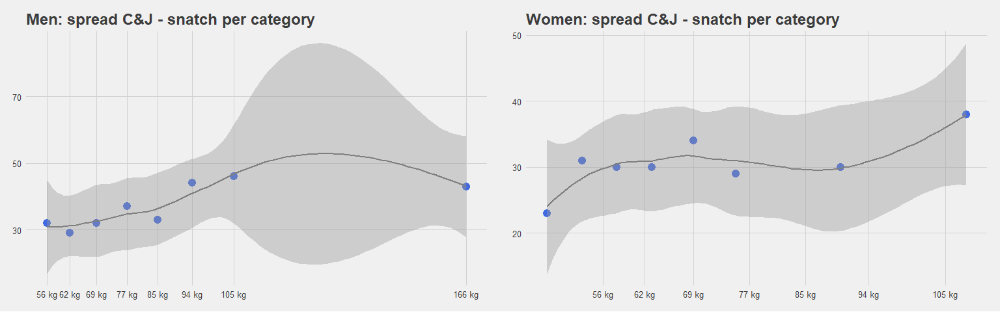
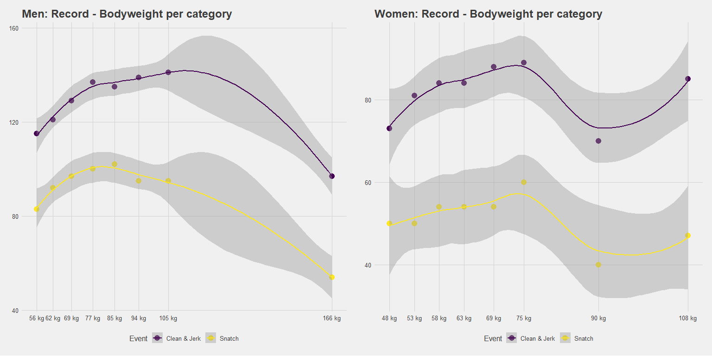

Olympic weightlifting - how much should I lift ?
================================================

Human Bender
2018-10-28


Introduction
============

The other day I was watching (in loop I've to admit), a video of the strongest man or at least Olympic lifter [Lasha Talakhadze](https://www.youtube.com/watch?v=Ss2de7kwcA8&t=91s) trying to understand how can he pull 1/3 of a VW Cox above his head so easily. Then I asked myself "OK true, he's the absolute record man but relative to his bodyweight is it still true ?"

As the best things in life, the relation between personal record and bodyweight is not linear. I mean, at that time LT bodyweight was 166 kg and he snatched 220 kg, more or less 1.3 times his bodyweight. But in the lightest category (56 kg bodyweight) the world record is set at 139 kg, almost 2.5 times the corresponding bodyweight!

The natural next question is: "is there an optimum between those two extremes ?" A quick and dirty empirical way to find it out is to plot the world records vs weight category. Let's check it out.

Fetch the data from the Wikipedia page
======================================

Consider to give 2eur/year to Wikipedia ;)

``` r
url <- 'https://en.wikipedia.org/wiki/List_of_world_records_in_Olympic_weightlifting'
html <- read_html(url)
tables <- html_table(html, fill=TRUE)
length(tables)
```

    ## [1] 12

On the current consultation date, the 3rd table is the men records and the 7th the women records.

Clean and prepare the data for the plot
=======================================

``` r
# Select the 2018 era records
men_dt <- setDT(tables[[3]])
# Filter the crapy table in a dirty way
cat_idx <- seq(1, nrow(men_dt), by = 4)
cat_men <- c(as.vector(men_dt[cat_idx, 1]))
cat_men <- rep(cat_men$Event, each = 3)
# As the last category has no maximum, let's set LT's bodyweight as standard
cat_men[(length(cat_men)-2):length(cat_men)] <- rep("166 kg", 3)
# filter out rows separating the category and instead create a categorical variable/column
men_dt <- men_dt[!cat_idx, ]
men_dt <- men_dt[, category := cat_men]
men_dt <- men_dt[, Ref := NULL]
men_dt <- men_dt[, Ratio := readr::parse_number(Record) / readr::parse_number(category)]
men_dt <- men_dt[, weight_over_bw := readr::parse_number(Record) - readr::parse_number(category)]

# Let's do the same for the women records
women_dt <- setDT(tables[[7]])
cat_idx <- seq(1, nrow(women_dt), by = 4)
cat_women <- c(as.vector(women_dt[cat_idx, 1]))
cat_women <- rep(cat_women$Event, each = 3)
cat_women[(length(cat_women)-2):length(cat_women)] <- rep("108 kg", 3)
women_dt <- women_dt[!cat_idx, ]
women_dt <- women_dt[, category := cat_women]
women_dt <- women_dt[, Ref := NULL]
women_dt <- women_dt[, Ratio := readr::parse_number(Record)/readr::parse_number(category)]
women_dt <- women_dt[, weight_over_bw := readr::parse_number(Record) - readr::parse_number(category)]
```

``` r
# linspace
XX = seq(min(readr::parse_number(men_dt$category))-20, max(readr::parse_number(men_dt$category))+20, by = 1)
cat_num <- as.vector(unique(readr::parse_number(men_dt$category)) )
snatch_rec_num <- as.vector(readr::parse_number(men_dt[Event == "Snatch", Record]))
cj_rec_num <- as.vector(readr::parse_number(men_dt[Event == "Clean & Jerk", Record]))
tot_rec_num <- as.vector(readr::parse_number(men_dt[Event == "Total", Record]))

# create the data.table for the snatch
dat_df <- data.table(x = cat_num, y = snatch_rec_num)

# Fit a GAM using non-decreasing P-splines, however I'll not plot that because for women the records are not monotoneous
sm_sp <- scam::scam(y~s(x,k=3, bs="mpi",m=1), data=dat_df)
sp_snatch <- predict(sm_sp, data.frame(x=XX), se = T )

# create the data.table for the C&J, yeah I know I should write a cleaner code. Lazy on this one just ctrl+C/V
dat_df <- data.frame(x = cat_num, y = cj_rec_num)
sm_sp <- scam::scam(y~s(x,k=3,bs="mpi",m=1), data=dat_df)
sp_cj <- predict(sm_sp, data.frame(x=XX), se = T )

# create the data.table for the total
dat_df <- data.frame(x = cat_num, y = tot_rec_num)
sm_sp <- scam::scam(y~s(x,k=3,bs="mpi",m=1), data=dat_df)
sp_tot <- predict(sm_sp, data.frame(x=XX), se = T )

# the final data.table (if there is a place on earth where unicorns are running in fields of flowers, that's thanks to data.table and probably LSD too)
sp_pr_dt <- data.table(bw = XX, snatch =  sp_snatch$fit, cj =  sp_cj$fit, tot =  sp_tot$fit)
sp_pr_dt <- melt(data = sp_pr_dt, id.vars = "bw")

# more stuff I'm not gonna use in the end
snatch_rec_num <- as.vector(readr::parse_number(men_dt[Event == "Snatch", Ratio]))
cj_rec_num <- as.vector(readr::parse_number(men_dt[Event == "Clean & Jerk", Ratio]))
tot_rec_num <- as.vector(readr::parse_number(men_dt[Event == "Total", Ratio]))

dat_df <- data.table(x = cat_num, y = snatch_rec_num)
#SchuSp <- Schumaker(cat_num, snatch_rec_num)$Spline 
sm_sp <- scam::scam(y~s(x,k=3,bs="mpd",m=1), data=dat_df)
sp_snatch <- predict(sm_sp, data.frame(x=XX), se = T )
#sp_snatch <- SchuSp(XX)

dat_df <- data.table(x = cat_num, y = cj_rec_num)
sm_sp <- scam::scam(y~s(x,k=3,bs="mpd",m=1), data=dat_df)
sp_cj <- predict(sm_sp, data.frame(x=XX), se = T )

dat_df <- data.table(x = cat_num, y = tot_rec_num)
sm_sp <- scam::scam(y~s(x,k=3,bs="mpd",m=1), data=dat_df)
sp_tot <- predict(sm_sp, data.frame(x=XX), se = T )

sp_ratio_dt <- data.table(bw = XX, snatch =  sp_snatch$fit, cj =  sp_cj$fit, tot =  sp_tot$fit)
# melting stuff is funny, ask T1000
sp_ratio_dt <- melt(data = sp_ratio_dt, id.vars = "bw")
```

Mighty ggplot2
==============

Ratio record/bodyweight
-----------------------

The first part was not so funny. Let's see for which category the ratio $\\frac{\\text{record}}{bodyweight}$ is the largest, meaning the *relative* strongest category. I also plot the absolute record vs bodyweight, just to visualise the slope.

``` r
# Here is some crappy code of mine to plot the record (or ratio rec/bodyweight) vs bodyweight
p <- ggplot(men_dt, aes(x=readr::parse_number(category), y=readr::parse_number(Record), color = Event))

# if you prefer the GAM fit, uncomment the geom_line and comment the geom_smooth
p <- p + geom_point(size = 4) + 
  #geom_line(data = sp_pr_dt, aes(x= bw, y = value, color = variable)) +
  geom_smooth(method = 'loess', se = T) + 
  theme_fivethirtyeight() + 
  scale_x_continuous( breaks = unique(parse_number(men_dt$category)), label = unique(men_dt$category) ) + 
  ggtitle('Men: Record per category (Bodyweight)') + 
  xlab('Category  [kg]') + ylab('Record [kg]') + scale_color_viridis_d()

p2 <- ggplot(men_dt, aes(x=readr::parse_number(category), y=Ratio, color = Event)) + geom_point(size = 4) +
  #geom_line(data = sp_ratio_dt, aes(x= bw, y = value, color = variable)) +
  geom_smooth(method = 'loess', se = T) + 
  theme_fivethirtyeight() + 
  scale_x_continuous( breaks = unique(parse_number(men_dt$category)), label = unique(men_dt$category) ) + 
  ggtitle('Men: ratio Rec/Bodyweight per category') + 
  xlab('Category [kg]') + ylab('Record / Bodyweight') + scale_color_viridis_d()

p3 <- ggplot(women_dt, aes(x=readr::parse_number(category), y=readr::parse_number(Record), color = Event))

p3 <- p3 + geom_point(size = 4) + 
  #geom_line(data = sp_pr_dt, aes(x= bw, y = value, color = variable)) +
  geom_smooth(method = 'loess', se = T) + 
  theme_fivethirtyeight() + 
  scale_x_continuous( breaks = unique(parse_number(women_dt$category)), label = unique(women_dt$category) ) + 
  ggtitle('Women: Record per category (Bodyweight)') + 
  scale_color_viridis_d()

p4 <- ggplot(women_dt, aes(x=readr::parse_number(category), y=Ratio, color = Event)) + geom_point(size = 4) +
  #geom_line(data = sp_ratio_dt, aes(x= bw, y = value, color = variable)) +
  geom_smooth(method = 'loess', se = T) + 
  theme_fivethirtyeight() + 
  scale_x_continuous( breaks = unique(parse_number(women_dt$category)), label = unique(women_dt$category) ) + 
  ggtitle('Women: ratio Rec/Bodyweight per category') + 
  xlab('Category [kg]') + ylab('Record / Bodyweight') + scale_color_viridis_d()

# Grid them all
plot_grid(p, p2, p3, p4, align = 'h', nrow = 2)
```



**Left panels**: the absolute records vs bodyweight. The heavier the athlete, the heavier the lift. However, the gain is smaller and smaller as the bodyweight increases, at least for men. The curve is like a frown. You'll lift heavier if your bodyweight is larger but if you weight 112 kg you'll not lift twice as much than the 56 kg record man. For women, there is a strange kind of plateau for the 75 - 90 kg category.

**Right panels**, the ratio $\\frac{\\text{record}}{bodyweight}$ vs bodyweight. For the Clean and Jerk, this ratio is larger than 3 for the 56 kg category. The record man of this category can C&J more than 3 times his bodyweight (which is quite amazing). Regarding the heaviest category, represented by Lasha the strongest man on earth, the ratio is *only* about 1.6. Twice smaller.

Another question we can answer empirically is: what should be the difference between my snatch and my clean and jerk personal records? On the previous charts, we can observe that the spread, the distance, between the snatch and C&J curve seems to be more or less constant

``` r
cj_snatch = men_dt[Event != "Total", .(Event, Record, category)]
cj_snatch = data.table::dcast(cj_snatch, category ~ Event, value.var = 'Record')
colnames(cj_snatch) = c("category", "cleanJ", "snatch")
cj_snatch = cj_snatch[, spread := readr::parse_number(cleanJ)  - readr::parse_number(snatch)]

cj_snatch_w = women_dt[Event != "Total", .(Event, Record, category)]
cj_snatch_w = data.table::dcast(cj_snatch_w, category ~ Event, value.var = 'Record')
colnames(cj_snatch_w) = c("category", "cleanJ", "snatch")
cj_snatch_w = cj_snatch_w[, spread := readr::parse_number(cleanJ)  - readr::parse_number(snatch)]
```

``` r
# more crappy code
p <- ggplot(cj_snatch, aes(x=readr::parse_number(category), y=spread))

# if you prefer the GAM fit, uncomment the geom_line and comment the geom_smooth
p <- p + geom_point(size = 4, color = "royalblue") + 
  #geom_line(data = sp_pr_dt, aes(x= bw, y = value, color = variable)) +
  geom_smooth(method = 'loess', se = T, color = "grey50") + 
  theme_fivethirtyeight() + 
  scale_x_continuous( breaks = unique(parse_number(men_dt$category)), label = unique(men_dt$category) ) + 
  ggtitle('Men: spread C&J - snatch per category') + 
  xlab('Category / kg') + ylab('spread / kg') + scale_color_viridis_d()

# women
p_w <- ggplot(cj_snatch_w, aes(x=readr::parse_number(category), y=spread))

# if you prefer the GAM fit, uncomment the geom_line and comment the geom_smooth
p_w <- p_w + geom_point(size = 4, color = "royalblue") + 
  #geom_line(data = sp_pr_dt, aes(x= bw, y = value, color = variable)) +
  geom_smooth(method = 'loess', se = T, color = "grey50") + 
  theme_fivethirtyeight() + 
  scale_x_continuous( breaks = unique(parse_number(men_dt$category)), label = unique(men_dt$category) ) + 
  ggtitle('Women: spread C&J - snatch per category') + 
  xlab('Category / kg') + ylab('spread / kg') + scale_color_viridis_d()

# Grid them all
plot_grid(p, p_w, align = 'h', ncol = 2)
```



The spread between C&J and snatch for men is increasing with the bodyweight (starting at 30 kg difference and peaking at almost 50 kg) whereas the spread is constant for women at the notable exception of the heaviest category.

How much more than your bodyweight can you lift?
------------------------------------------------

Another possibility the measure the efficiency is to measure the weight subtracted by your bodyweight (let's do that for Olympic athletes, in order to have positive numbers). So if an Athlete, 100 kg bodyweight, can snatch 202 kg then the result is therefore 102 kg.

``` r
# Here is some crappy code of mine to plot the record (or ratio rec/bodyweight) vs bodyweight
p <- ggplot(men_dt[Event != "Total"], aes(x=readr::parse_number(category), 
                        y=weight_over_bw, 
                        color = Event))

# if you prefer the GAM fit, uncomment the geom_line and comment the geom_smooth
p <- p + geom_point(size = 4) + 
  #geom_line(data = sp_pr_dt, aes(x= bw, y = value, color = variable)) +
  geom_smooth(method = 'loess', se = T) + 
  theme_fivethirtyeight() + 
  scale_x_continuous( breaks = unique(parse_number(men_dt$category)), label = unique(men_dt$category) ) + 
  ggtitle('Men: Record - Bodyweight per category') + 
  xlab('Category / kg') + ylab('Record / kg') + scale_color_viridis_d()


p3 <- ggplot(women_dt[Event != "Total"], aes(x=readr::parse_number(category), 
                        y=weight_over_bw, 
                        color = Event))
p3 <- p3 + geom_point(size = 4) + 
  #geom_line(data = sp_pr_dt, aes(x= bw, y = value, color = variable)) +
  geom_smooth(method = 'loess', se = T) + 
  theme_fivethirtyeight() + 
  scale_x_continuous( breaks = unique(parse_number(women_dt$category)), label = unique(women_dt$category) ) + 
  ggtitle('Women: Record - Bodyweight per category') + 
  xlab('Category / kg') + ylab('Record / kg') + scale_color_viridis_d()


# Grid them all
plot_grid(p, p3, align = 'h', ncol = 2)
```



This chart is very informative and reveals that the 77 and 85 kg men categories are pretty efficient compared to the other categories, especially the heaviest. The 77 kg record man can snatch +- 100 kg more than his bodyweight whereas the LT snatched "only" +- 55 kg more than his bodyweight. How impressive is this! Whatever your category the limit seems to be 100 kg more than your bodyweight, at most (and +- 140 kg for clean and jerk). Both for the C&J and snatch, the curve looks like a "frown", the optimum being reached at the categories 105 kg and 85 kg, respectively.

For women, the curve shape is a bit different due to the heaviest category. However, the most efficient one is the 75kg category. The performance is pretty constant across the 58, 63 and 69kg categories. Only the 75kg category peaks.

Of course this is a simplistic analysis, because the bodyweight cannot be the only explicative variable. Since all is about lifting a weight above the head, the body height should be significant as well (considering physics and work to be done to lift the bar at a given height, etc.). The height and the bodyweight are correlated, as you guessed. The rest is explained pretty "easily" (or not) after 5 years studying the bio-mechanics of the human body.

[Is there an asymptote, a limit ?](https://www.youtube.com/watch?v=8COaMKbNrX0&fbclid=IwAR2MBQOSZnwTxqRWLQ5Ja72O9CrGfxP2zaTkAFoUccGxQK8XS8TBZY9nifU)
